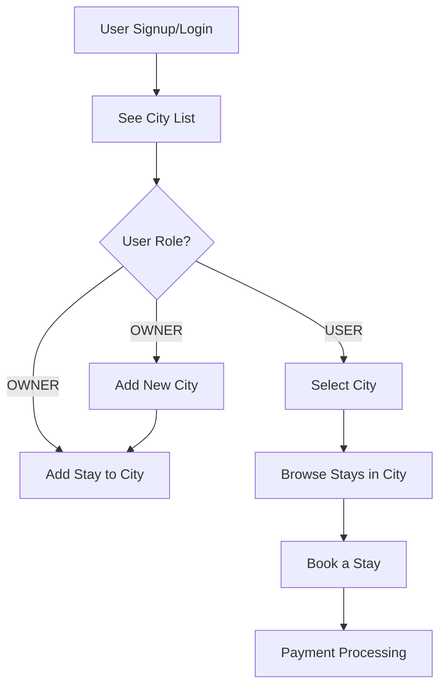
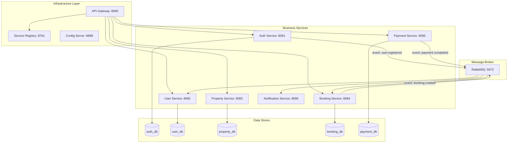
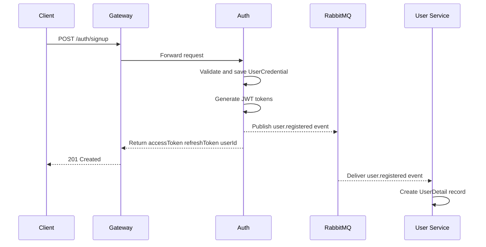
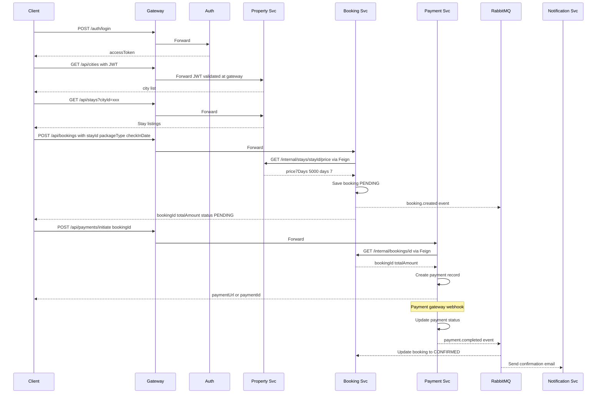
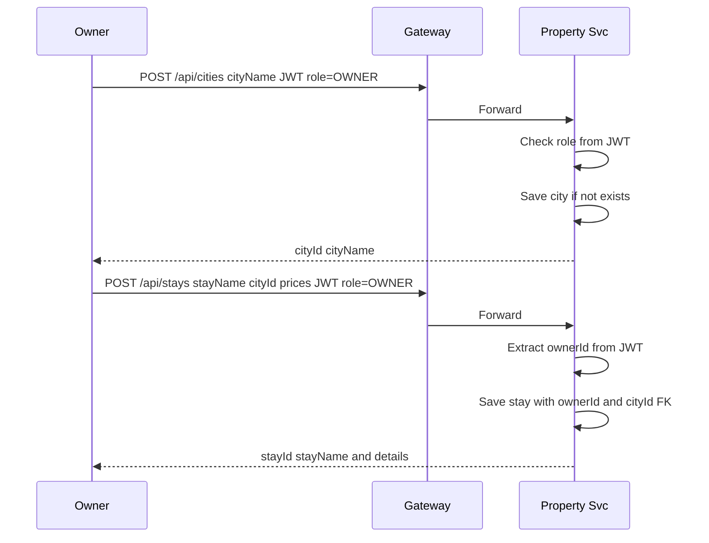
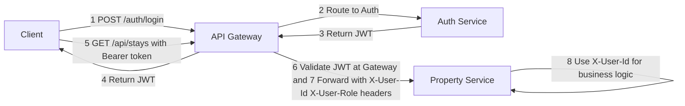

# 🏗️ NomadStay Backend — Industry-Level Microservices Migration Planner

---

## 📌 Executive Summary

Transform the current **monolithic Spring Boot application** into a **production-grade microservices architecture** using Spring Cloud, with proper database isolation, event-driven communication, centralized gateway, and service discovery.

---

## 1. Current State Analysis

### 1.1 Existing Modules & Structure

```
Normad_stay_real_backend/
├── auth/        → Signup, Login, JWT generation
├── user/        → User profile (CRUD via credentialId)
├── Stay/        → Property listings (add/view stays)
├── bookings/    → Booking creation (incomplete controller)
├── city/        → City management (add/list cities for destinations)
├── common/      → SecurityConfig, JwtUtils, ApiResponse, Exceptions
├── Health/      → Health check endpoint
└── NormadStayRealBackendApplication.java
```

### 1.2 Current Application Flow



### 1.3 Current Tech Stack

| Component        | Technology                  |
|------------------|-----------------------------|
| Framework        | Spring Boot 3.5.13          |
| Language         | Java 17                     |
| Database         | PostgreSQL (Supabase)       |
| ORM              | Spring Data JPA / Hibernate |
| Auth             | JWT (jjwt 0.12.6)           |
| Security         | Spring Security (stateless) |
| Build            | Maven                       |
| Utilities        | Lombok, Validation, Mail, Actuator |

### 1.4 Critical Problems Identified in Current Code

> [!WARNING]
> These issues MUST be fixed regardless of whether you migrate to microservices.

| #  | Problem | Where | Impact |
|----|---------|-------|--------|
| 1  | **Tight coupling**: `AuthService` directly imports and saves `UserDetail` entity from user module | `AuthService.java:12-13, 75-83` | Modules are not independently deployable |
| 2  | **Duplicated auth logic**: `getUserRole()` and token validation is copy-pasted across `StayService`, `BookingService`, `CityServices`, `UserDetailService` | 4 service files | Maintenance nightmare, violates DRY |
| 3  | **No JWT filter**: Security config permits all endpoints (`/auth/**`, `/user/**`, `/stays/**`, `/dest/**`). JWT is validated manually in each service instead of via a Spring Security filter | `SecurityConfig.java:37` | No centralized authentication; every endpoint is publicly accessible |
| 4  | **No `ownerId` on Stay entity**: Stays have no link to who created them. Any OWNER can modify any stay | `Stay.java` | Data integrity / authorization gap |
| 5  | **BookingController is empty**: No REST endpoints wired | `BookingController.java` | Booking feature non-functional via HTTP |
| 6  | **No `userId` set on BookingEntity**: `createBooking()` never sets `userId` from token | `BookingService.java:46-57` | Bookings are orphaned — cannot track who booked |
| 7  | **Hardcoded booking values**: `totalDays=7`, `totalAmount=500.0` — ignores `PackageType` and actual stay price | `BookingService.java:39,52` | Incorrect billing |
| 8  | **`@NotBlank` on non-String fields**: Used on `UUID`, `int`, `PackageType`, `LocalDate` in `CreateBookingRequest` — will throw runtime errors | `CreateBookingRequest.java` | Validation broken |
| 9  | **Credentials in properties file**: DB password and JWT secret are hardcoded | `application.properties` | Security vulnerability |
| 10 | **No refresh token**: Only access token, no token refresh mechanism | Auth module | Poor UX, forced re-login |
| 11 | **Entity returned directly from controller**: `CityController` returns `Cities` entity, not a DTO | `CityController.java:32` | Leaks internal DB structure |
| 12 | **Unused import**: `javax.swing.*` imported in `Cities.java` | `Cities.java:10` | Code smell |
| 13 | **`private` controller methods**: `StayController` handler methods are `private` instead of `public` — Spring MVC may not proxy them correctly | `StayController.java:26,38` | Potential request mapping failure |

---

## 2. Target Microservices Architecture

### 2.1 Service Decomposition



### 2.2 Multi-Module Maven Project Structure

```
nomadstay-microservices/                          (parent POM)
├── pom.xml                                       (parent - dependency management)
│
├── nomadstay-common/                             (shared library JAR)
│   ├── pom.xml
│   └── src/main/java/com/nomadstay/common/
│       ├── dto/ApiResponse.java
│       ├── dto/PagedResponse.java
│       ├── enums/Role.java
│       ├── exception/
│       │   ├── BadRequestException.java
│       │   ├── ResourceNotFoundException.java
│       │   ├── UnauthorizedException.java
│       │   └── GlobalExceptionHandler.java
│       ├── security/JwtUtils.java
│       ├── security/JwtAuthenticationFilter.java
│       └── event/                                (shared event DTOs)
│           ├── UserRegisteredEvent.java
│           ├── BookingCreatedEvent.java
│           └── PaymentCompletedEvent.java
│
├── nomadstay-service-registry/                   (Eureka Server)
│   ├── pom.xml
│   └── src/main/java/.../ServiceRegistryApp.java
│
├── nomadstay-config-server/                      (Spring Cloud Config)
│   ├── pom.xml
│   └── src/main/java/.../ConfigServerApp.java
│
├── nomadstay-api-gateway/                        (Spring Cloud Gateway)
│   ├── pom.xml
│   └── src/main/java/.../ApiGatewayApp.java
│
├── nomadstay-auth-service/                       (Port 8081)
│   ├── pom.xml
│   └── src/main/java/com/nomadstay/auth/
│       ├── AuthServiceApp.java
│       ├── controller/AuthController.java
│       ├── dto/{SignupRequest,LoginRequest,AuthResponse,TokenRefreshRequest}.java
│       ├── entity/UserCredential.java
│       ├── repository/UserCredentialRepository.java
│       ├── service/AuthService.java
│       └── config/SecurityConfig.java
│
├── nomadstay-user-service/                       (Port 8082)
│   ├── pom.xml
│   └── src/main/java/com/nomadstay/user/
│       ├── UserServiceApp.java
│       ├── controller/UserController.java
│       ├── dto/{UserDetailResponse,UpdateProfileRequest}.java
│       ├── entity/UserDetail.java
│       ├── repository/UserDetailsRepository.java
│       ├── service/UserService.java
│       ├── listener/UserEventListener.java        (listens for user.registered)
│       └── config/SecurityConfig.java
│
├── nomadstay-property-service/                   (Port 8083)  [Stay + City merged]
│   ├── pom.xml
│   └── src/main/java/com/nomadstay/property/
│       ├── PropertyServiceApp.java
│       ├── controller/{StayController,CityController}.java
│       ├── dto/{AddStayRequest,StayDetailResponse,CityRequest,CityResponse,StaySearchRequest}.java
│       ├── entity/{Stay,City}.java
│       ├── repository/{StayRepository,CityRepository}.java
│       ├── service/{StayService,CityService}.java
│       └── config/SecurityConfig.java
│
├── nomadstay-booking-service/                    (Port 8084)
│   ├── pom.xml
│   └── src/main/java/com/nomadstay/booking/
│       ├── BookingServiceApp.java
│       ├── controller/BookingController.java
│       ├── dto/{CreateBookingRequest,BookingResponse,BookingListResponse}.java
│       ├── entity/Booking.java
│       ├── enums/{BookingStatus,PackageType,PaymentStatus}.java
│       ├── repository/BookingRepository.java
│       ├── service/BookingService.java
│       ├── client/PropertyServiceClient.java      (OpenFeign → Property Service)
│       └── config/SecurityConfig.java
│
├── nomadstay-payment-service/                    (Port 8085)
│   ├── pom.xml
│   └── src/main/java/com/nomadstay/payment/
│       ├── PaymentServiceApp.java
│       ├── controller/PaymentController.java
│       ├── dto/{InitiatePaymentRequest,PaymentResponse,PaymentWebhookRequest}.java
│       ├── entity/Payment.java
│       ├── repository/PaymentRepository.java
│       ├── service/PaymentService.java
│       └── config/SecurityConfig.java
│
└── nomadstay-notification-service/               (Port 8086)
    ├── pom.xml
    └── src/main/java/com/nomadstay/notification/
        ├── NotificationServiceApp.java
        ├── listener/NotificationEventListener.java
        ├── service/{EmailService,PushNotificationService}.java
        └── config/MailConfig.java
```

---

## 3. Database Strategy — The Core Logic

> [!IMPORTANT]
> This is the most critical section. In microservices, **each service owns its own database schema**. Services NEVER directly query another service's database. They communicate via **UUIDs as foreign references** + **API calls or events**.

### 3.1 Database-Per-Service Mapping

| Service | Database / Schema | Tables | Owns |
|---------|-------------------|--------|------|
| **Auth Service** | `nomadstay_auth` | `user_credentials` | Login credentials, hashed passwords, roles |
| **User Service** | `nomadstay_user` | `user_details` | Profile data, bio, avatar, address |
| **Property Service** | `nomadstay_property` | `stays`, `cities`, `stay_amenities`, `stay_images` | All property/listing data + city catalog |
| **Booking Service** | `nomadstay_booking` | `bookings` | Reservations, dates, status |
| **Payment Service** | `nomadstay_payment` | `payments`, `refunds` | Transaction records, payment gateway refs |

### 3.2 How Services Stay Connected (Cross-Service Data Links)

```mermaid
erDiagram
    AUTH_DB__user_credentials {
        UUID id PK
        String phone_no UK
        String email UK
        String password
        Role role
        LocalDateTime created_at
    }

    USER_DB__user_details {
        UUID id PK
        UUID credential_id FK_LOGICAL "links to auth_db.user_credentials.id"
        String username
        String profile_pic
        String bio
        String address
        String phone_no
        String email
        Role role
    }

    PROPERTY_DB__cities {
        UUID id PK
        String city_name UK
        String state
        String country
        UUID added_by "links to auth_db.user_credentials.id OWNER"
    }

    PROPERTY_DB__stays {
        UUID id PK
        UUID owner_id "links to auth_db.user_credentials.id OWNER"
        UUID city_id FK "links to cities.id"
        String stay_name
        String description
        Double base_price
        Double price_7_days
        Double price_15_days
        Double price_30_days
        Boolean is_available
    }

    BOOKING_DB__bookings {
        UUID booking_id PK
        UUID user_id "links to auth_db.user_credentials.id USER"
        UUID stay_id "links to property_db.stays.id"
        LocalDate check_in_date
        LocalDate check_out_date
        Integer total_days
        PackageType package_type
        Double total_amount
        BookingStatus status
        PaymentStatus payment_status
    }

    PAYMENT_DB__payments {
        UUID id PK
        UUID booking_id "links to booking_db.bookings.booking_id"
        UUID user_id "links to auth_db.user_credentials.id"
        Double amount
        String payment_gateway_id
        PaymentStatus status
        String gateway_response
    }

    AUTH_DB__user_credentials ||--|| USER_DB__user_details : "credential_id"
    PROPERTY_DB__cities ||--o{ PROPERTY_DB__stays : "city_id"
    AUTH_DB__user_credentials ||--o{ PROPERTY_DB__stays : "owner_id"
    AUTH_DB__user_credentials ||--o{ BOOKING_DB__bookings : "user_id"
    PROPERTY_DB__stays ||--o{ BOOKING_DB__bookings : "stay_id"
    BOOKING_DB__bookings ||--|| PAYMENT_DB__payments : "booking_id"
```

### 3.3 The Golden Rule: How Cross-DB References Work

Since services **cannot JOIN across databases**, here's how each cross-reference is resolved:

#### Pattern 1: UUID as Logical Foreign Key (no DB-level FK constraint)

```java
// In Booking Service — bookings table stores stay_id but has NO FK to property_db
@Column(nullable = false)
private UUID stayId;    // References property_db.stays.id — but NO @ManyToOne

@Column(nullable = false)
private UUID userId;    // References auth_db.user_credentials.id — but NO @ManyToOne
```

There is **no JPA relationship annotation** (`@ManyToOne`, `@OneToMany`) across service boundaries. The UUID is just stored as a plain column.

#### Pattern 2: Synchronous Lookup via OpenFeign (when you need the data)

```java
// BookingService needs stay details to calculate price
@FeignClient(name = "nomadstay-property-service")
public interface PropertyServiceClient {

    @GetMapping("/api/internal/stays/{stayId}")
    ApiResponse<StayDetailResponse> getStayById(@PathVariable UUID stayId);

    @GetMapping("/api/internal/stays/{stayId}/price")
    ApiResponse<StayPriceResponse> getStayPrice(
        @PathVariable UUID stayId,
        @RequestParam PackageType packageType
    );
}
```

```java
// In BookingService.createBooking()
@Transactional
public BookingResponse createBooking(UUID userId, CreateBookingRequest req) {
    // 1. Call Property Service to get price (synchronous HTTP via Feign)
    StayPriceResponse price = propertyClient
        .getStayPrice(req.getStayId(), req.getPackageType()).getData();

    // 2. Calculate total
    int totalDays = price.getDaysForPackage();
    double totalAmount = price.getPriceForPackage();

    // 3. Create booking in booking_db
    Booking booking = Booking.builder()
        .userId(userId)          // from JWT — no DB FK to auth_db
        .stayId(req.getStayId()) // no DB FK to property_db
        .totalDays(totalDays)
        .totalAmount(totalAmount)
        .status(BookingStatus.PENDING)
        .build();

    bookingRepository.save(booking);

    // 4. Publish event for Payment & Notification services
    eventPublisher.publish(
        new BookingCreatedEvent(booking.getId(), userId, totalAmount));

    return mapToResponse(booking);
}
```

#### Pattern 3: Asynchronous Events via RabbitMQ (fire-and-forget)

```java
// Auth Service publishes after signup
@Transactional
public AuthResponse signupUser(SignupRequest req) {
    UserCredential cred = // ... save credential

    // Instead of directly calling userDetailsRepository.save() — THIS IS THE FIX
    // Publish event — User Service will listen and create UserDetail
    rabbitTemplate.convertAndSend(
        "nomadstay.exchange",
        "user.registered",
        UserRegisteredEvent.builder()
            .credentialId(cred.getId())
            .email(cred.getEmail())
            .phoneNo(cred.getPhoneNo())
            .role(cred.getRole())
            .build()
    );

    return buildAuthResponse(cred);
}
```

```java
// User Service listens
@RabbitListener(queues = "user.registration.queue")
public void handleUserRegistered(UserRegisteredEvent event) {
    UserDetail detail = UserDetail.builder()
        .credentialId(event.getCredentialId())
        .email(event.getEmail())
        .phoneNo(event.getPhoneNo())
        .role(event.getRole())
        .build();
    userDetailsRepository.save(detail);
    log.info("UserDetail created for credentialId: {}", event.getCredentialId());
}
```

### 3.4 Database Connection Configuration (Per Service)

Each microservice has its own `application.yml` pointing to its own schema:

```yaml
# nomadstay-auth-service/src/main/resources/application.yml
spring:
  application:
    name: nomadstay-auth-service
  datasource:
    url: jdbc:postgresql://${DB_HOST:localhost}:5432/nomadstay_auth
    username: ${DB_USER:postgres}
    password: ${DB_PASSWORD}
  jpa:
    hibernate:
      ddl-auto: validate           # NEVER use 'update' in production
    properties:
      hibernate:
        dialect: org.hibernate.dialect.PostgreSQLDialect
        format_sql: true
    show-sql: false                 # false in production
```

```yaml
# nomadstay-property-service/src/main/resources/application.yml
spring:
  application:
    name: nomadstay-property-service
  datasource:
    url: jdbc:postgresql://${DB_HOST:localhost}:5432/nomadstay_property
    username: ${DB_USER:postgres}
    password: ${DB_PASSWORD}
```

> [!TIP]
> **For Supabase / single PostgreSQL instance**: You can use **separate schemas** instead of separate databases. Each service connects to the same PostgreSQL host but uses a different schema:
> ```
> jdbc:postgresql://db.xxx.supabase.co:5432/postgres?currentSchema=nomadstay_auth
> jdbc:postgresql://db.xxx.supabase.co:5432/postgres?currentSchema=nomadstay_property
> ```
> This gives you logical isolation while sharing one Supabase project.

---

## 4. Inter-Service Communication Matrix

### 4.1 Who Calls Whom & How

| Caller | Callee | Method | Why |
|--------|--------|--------|-----|
| **API Gateway** | All Services | HTTP routing | Route external requests to correct service |
| **Booking Service** | **Property Service** | OpenFeign (sync) | Fetch stay price and availability before booking |
| **Booking Service** | **User Service** | OpenFeign (sync) | Validate user exists (optional, JWT already guarantees) |
| **Payment Service** | **Booking Service** | OpenFeign (sync) | Update booking status after payment |
| **Auth Service** | **User Service** | RabbitMQ (async) | Create UserDetail after signup |
| **Booking Service** | **Notification Service** | RabbitMQ (async) | Send booking confirmation email |
| **Payment Service** | **Notification Service** | RabbitMQ (async) | Send payment receipt email |
| **Payment Service** | **Booking Service** | RabbitMQ (async) | Mark booking as CONFIRMED after payment success |

### 4.2 Event Flow Diagrams

#### Flow 1: User Signup



#### Flow 2: Complete Booking Flow (The Main User Journey)



#### Flow 3: Owner Adds a Stay



---

## 5. Security Architecture

### 5.1 JWT Flow Across Services



### 5.2 Gateway-Level JWT Filter (Centralized Auth)

```java
// In API Gateway — validates JWT ONCE, then injects user context as headers
@Component
public class JwtAuthGatewayFilter implements GatewayFilterFactory<Config> {

    @Override
    public GatewayFilter apply(Config config) {
        return (exchange, chain) -> {
            String token = extractToken(exchange.getRequest());
            if (token != null && jwtUtils.isTokenValid(token)) {
                UUID userId = jwtUtils.getUserIdFromToken(token);
                String role = jwtUtils.getRoleFromToken(token);

                // Inject user context into downstream request headers
                ServerHttpRequest mutatedRequest = exchange.getRequest().mutate()
                    .header("X-User-Id", userId.toString())
                    .header("X-User-Role", role)
                    .build();

                return chain.filter(
                    exchange.mutate().request(mutatedRequest).build());
            }
            return sendUnauthorized(exchange);
        };
    }
}
```

### 5.3 Downstream Services Read Headers (No JWT Re-Parsing Needed)

```java
// In any downstream service controller — dead simple
@GetMapping("/profile")
public ResponseEntity<ApiResponse<UserDetailResponse>> getProfile(
    @RequestHeader("X-User-Id") UUID userId,
    @RequestHeader("X-User-Role") String role
) {
    // No more manual "Bearer " parsing!
    UserDetailResponse response = userService.getUserDetails(userId);
    return ResponseEntity.ok(ApiResponse.success("Profile fetched", response));
}
```

This eliminates ALL the duplicated `getUserRole()` / `extractCredentialId()` methods across services.

### 5.4 Internal Service-to-Service Auth

```yaml
# Internal endpoints are NOT exposed through the Gateway
# They use a separate path prefix: /api/internal/**
# Gateway route config blocks external access to /internal/**

# In gateway application.yml:
spring:
  cloud:
    gateway:
      routes:
        - id: property-service
          uri: lb://nomadstay-property-service
          predicates:
            - Path=/api/stays/**, /api/cities/**
          filters:
            - JwtAuthFilter
        # NOTE: /api/internal/** is NOT routed — only accessible service-to-service
```

---

## 6. API Design Standards

### 6.1 RESTful Endpoint Convention

| Service | Endpoint | Method | Role | Description |
|---------|----------|--------|------|-------------|
| **Auth** | `/auth/signup` | POST | Public | Register user |
| **Auth** | `/auth/login` | POST | Public | Login and get tokens |
| **Auth** | `/auth/refresh` | POST | Public | Refresh access token |
| **User** | `/api/users/profile` | GET | USER, OWNER | Get own profile |
| **User** | `/api/users/profile` | PUT | USER, OWNER | Update own profile |
| **Property** | `/api/cities` | GET | USER, OWNER | List all cities |
| **Property** | `/api/cities` | POST | OWNER | Add new city |
| **Property** | `/api/stays` | GET | USER, OWNER | List stays (filter by cityId) |
| **Property** | `/api/stays/{id}` | GET | USER, OWNER | Get stay details |
| **Property** | `/api/stays` | POST | OWNER | Add new stay |
| **Property** | `/api/stays/{id}` | PUT | OWNER | Update own stay |
| **Property** | `/api/stays/{id}` | DELETE | OWNER, ADMIN | Delete stay |
| **Booking** | `/api/bookings` | POST | USER | Create booking |
| **Booking** | `/api/bookings` | GET | USER | List own bookings |
| **Booking** | `/api/bookings/{id}` | GET | USER | Get booking details |
| **Booking** | `/api/bookings/{id}/cancel` | POST | USER | Cancel booking |
| **Booking** | `/api/bookings/stay/{stayId}` | GET | OWNER | List bookings for own stay |
| **Payment** | `/api/payments/initiate` | POST | USER | Initiate payment for booking |
| **Payment** | `/api/payments/{id}/status` | GET | USER | Check payment status |
| **Payment** | `/api/payments/webhook` | POST | Public | Payment gateway callback |

### 6.2 Standardized API Response

```json
{
    "success": true,
    "statusCode": "200",
    "message": "Stays fetched successfully",
    "data": {},
    "timestamp": "2026-04-19T03:30:00",
    "traceId": "abc-123-def"
}
```

---

## 7. Infrastructure Components

### 7.1 Service Registry (Eureka Server)

```yaml
# nomadstay-service-registry/application.yml
server:
  port: 8761
eureka:
  client:
    register-with-eureka: false
    fetch-registry: false
```

Each microservice registers itself:
```yaml
# In every microservice's application.yml
eureka:
  client:
    service-url:
      defaultZone: http://localhost:8761/eureka/
  instance:
    prefer-ip-address: true
```

### 7.2 API Gateway Routes

```yaml
# nomadstay-api-gateway/application.yml
server:
  port: 8080

spring:
  cloud:
    gateway:
      routes:
        - id: auth-service
          uri: lb://nomadstay-auth-service
          predicates:
            - Path=/auth/**
          filters:
            - RewritePath=/auth/(?<segment>.*), /auth/${segment}

        - id: user-service
          uri: lb://nomadstay-user-service
          predicates:
            - Path=/api/users/**
          filters:
            - JwtAuthFilter

        - id: property-service
          uri: lb://nomadstay-property-service
          predicates:
            - Path=/api/stays/**, /api/cities/**
          filters:
            - JwtAuthFilter

        - id: booking-service
          uri: lb://nomadstay-booking-service
          predicates:
            - Path=/api/bookings/**
          filters:
            - JwtAuthFilter

        - id: payment-service
          uri: lb://nomadstay-payment-service
          predicates:
            - Path=/api/payments/**
          filters:
            - JwtAuthFilter
```

### 7.3 RabbitMQ Exchange & Queue Setup

```
Exchange: nomadstay.exchange (topic)
│
├── Routing Key: user.registered
│   └── Queue: user.registration.queue         → User Service listens
│
├── Routing Key: booking.created
│   └── Queue: booking.notification.queue      → Notification Service listens
│
├── Routing Key: payment.completed
│   ├── Queue: booking.payment.queue           → Booking Service listens (update status)
│   └── Queue: payment.notification.queue      → Notification Service listens
│
└── Routing Key: booking.cancelled
    └── Queue: cancellation.notification.queue → Notification Service listens
```

---

## 8. Database Migration Strategy (Flyway)

> [!IMPORTANT]
> Replace `hibernate.ddl-auto=update` with **Flyway** for production. Every schema change is a versioned SQL file.

```
nomadstay-auth-service/src/main/resources/db/migration/
├── V1__create_user_credentials_table.sql
├── V2__add_refresh_token_column.sql
└── V3__add_last_login_column.sql

nomadstay-property-service/src/main/resources/db/migration/
├── V1__create_cities_table.sql
├── V2__create_stays_table.sql
├── V3__create_stay_amenities_table.sql
├── V4__create_stay_images_table.sql
└── V5__add_owner_id_to_stays.sql
```

---

## 9. Docker Compose (Local Development)

```yaml
version: '3.8'
services:
  # --- Infrastructure ---
  postgres:
    image: postgres:16-alpine
    environment:
      POSTGRES_USER: postgres
      POSTGRES_PASSWORD: ${DB_PASSWORD}
    ports:
      - "5432:5432"
    volumes:
      - ./init-databases.sql:/docker-entrypoint-initdb.d/init.sql
      - pg_data:/var/lib/postgresql/data

  rabbitmq:
    image: rabbitmq:3-management-alpine
    ports:
      - "5672:5672"
      - "15672:15672"
    environment:
      RABBITMQ_DEFAULT_USER: nomadstay
      RABBITMQ_DEFAULT_PASS: ${RABBITMQ_PASSWORD}

  # --- Infrastructure Services ---
  service-registry:
    build: ./nomadstay-service-registry
    ports:
      - "8761:8761"

  api-gateway:
    build: ./nomadstay-api-gateway
    ports:
      - "8080:8080"
    depends_on:
      - service-registry
    environment:
      EUREKA_URI: http://service-registry:8761/eureka/

  # --- Business Services ---
  auth-service:
    build: ./nomadstay-auth-service
    ports:
      - "8081:8081"
    depends_on:
      - postgres
      - rabbitmq
      - service-registry
    environment:
      DB_HOST: postgres
      DB_PASSWORD: ${DB_PASSWORD}
      JWT_SECRET: ${JWT_SECRET}
      RABBITMQ_HOST: rabbitmq

  user-service:
    build: ./nomadstay-user-service
    ports:
      - "8082:8082"
    depends_on:
      - postgres
      - rabbitmq
      - service-registry

  property-service:
    build: ./nomadstay-property-service
    ports:
      - "8083:8083"
    depends_on:
      - postgres
      - service-registry

  booking-service:
    build: ./nomadstay-booking-service
    ports:
      - "8084:8084"
    depends_on:
      - postgres
      - rabbitmq
      - service-registry

  payment-service:
    build: ./nomadstay-payment-service
    ports:
      - "8085:8085"
    depends_on:
      - postgres
      - rabbitmq
      - service-registry

  notification-service:
    build: ./nomadstay-notification-service
    ports:
      - "8086:8086"
    depends_on:
      - rabbitmq
      - service-registry

volumes:
  pg_data:
```

```sql
-- init-databases.sql (creates schemas on first boot)
CREATE SCHEMA IF NOT EXISTS nomadstay_auth;
CREATE SCHEMA IF NOT EXISTS nomadstay_user;
CREATE SCHEMA IF NOT EXISTS nomadstay_property;
CREATE SCHEMA IF NOT EXISTS nomadstay_booking;
CREATE SCHEMA IF NOT EXISTS nomadstay_payment;
```

---

## 10. Phased Implementation Roadmap

### Phase 1: Fix Current Monolith (Week 1) — Foundation

> Fix critical bugs in the existing codebase before migration.

- [ ] Add proper `JwtAuthenticationFilter` to Spring Security filter chain
- [ ] Remove all duplicated `getUserRole()` / `extractCredentialId()` methods
- [ ] Fix `BookingController` — wire all REST endpoints
- [ ] Fix `BookingService` — set `userId` from token, calculate real price
- [ ] Fix `CreateBookingRequest` — replace `@NotBlank` with `@NotNull` for non-String fields
- [ ] Add `ownerId` (UUID) column to `Stay` entity
- [ ] Link `Stay` to `City` via `cityId` FK instead of String `city`
- [ ] Fix `StayController` private methods to public
- [ ] Remove `javax.swing` import from `Cities.java`
- [ ] Move credentials to environment variables
- [ ] Return DTOs from all controllers (no raw entity responses)

### Phase 2: Restructure as Modular Monolith (Week 2) — Internals

> Refactor internal package boundaries to mirror future microservices.

- [ ] Create clear package boundaries — each module communicates via interfaces (not direct repository imports)
- [ ] Create `AuthService` to `UserService` interface for user creation (remove direct `UserDetailsRepository` dependency from `AuthService`)
- [ ] Create `BookingService` to `StayService` interface for price lookup
- [ ] Introduce `ApplicationEvent` for async operations (Spring's built-in events)
- [ ] Add MapStruct or manual mapper classes for Entity to DTO conversion
- [ ] Add pagination support (`Pageable`) to list endpoints

### Phase 3: Multi-Module Maven Setup (Week 3) — Structure

> Create the Maven multi-module project and extract shared code.

- [ ] Create parent `pom.xml` with `dependencyManagement`
- [ ] Extract `nomadstay-common` module (DTOs, exceptions, JWT utils, events)
- [ ] Create skeleton projects for each service
- [ ] Set up per-service `application.yml` with schema-isolated DB connections
- [ ] Configure Flyway migrations per service

### Phase 4: Infrastructure Services (Week 4) — Cloud

> Stand up the Spring Cloud infrastructure.

- [ ] Set up Eureka Service Registry
- [ ] Set up Spring Cloud Gateway with route configuration
- [ ] Implement `JwtAuthGatewayFilter` for centralized JWT validation
- [ ] Set up RabbitMQ with exchanges, queues, and bindings
- [ ] Configure OpenFeign clients for synchronous inter-service calls
- [ ] Add Resilience4j circuit breakers to Feign clients

### Phase 5: Migrate Business Logic (Weeks 5-6) — Migration

> Move each module into its own independently deployable service.

- [ ] Migrate Auth Service (port 8081) — with event publishing for signup
- [ ] Migrate User Service (port 8082) — with RabbitMQ listener for user.registered
- [ ] Migrate Property Service (port 8083) — Stay + City combined
- [ ] Migrate Booking Service (port 8084) — with Feign client to Property Service
- [ ] Migrate Payment Service (port 8085) — with Razorpay/Stripe integration
- [ ] Migrate Notification Service (port 8086) — email via Spring Mail

### Phase 6: Production Hardening (Week 7+) — Production

- [ ] Add distributed tracing (Micrometer Tracing + Zipkin)
- [ ] Centralized logging (ELK Stack or Loki)
- [ ] Health checks and readiness probes per service
- [ ] Rate limiting at API Gateway
- [ ] Dockerize all services
- [ ] Set up CI/CD pipeline (GitHub Actions)
- [ ] Add integration tests with Testcontainers
- [ ] API documentation with SpringDoc OpenAPI (Swagger)
- [ ] Kubernetes deployment manifests (optional)

---

## 11. Key Technology Additions

| Category | Current | Target |
|----------|---------|--------|
| Service Discovery | None | Spring Cloud Netflix Eureka |
| API Gateway | None | Spring Cloud Gateway |
| Inter-Service Sync | Direct method calls | OpenFeign + Resilience4j |
| Inter-Service Async | ApplicationEventPublisher (in-process) | RabbitMQ / AMQP |
| Configuration | application.properties hardcoded | Spring Cloud Config Server + env vars |
| DB Migrations | hibernate.ddl-auto=update | Flyway versioned migrations |
| Monitoring | Actuator only | Actuator + Prometheus + Grafana |
| Tracing | None | Micrometer Tracing + Zipkin |
| Containerization | None | Docker + Docker Compose |
| API Docs | None | SpringDoc OpenAPI (Swagger UI) |

---

## 12. Dependency Versions (Parent POM)

```xml
<properties>
    <java.version>17</java.version>
    <spring-boot.version>3.5.13</spring-boot.version>
    <spring-cloud.version>2024.0.1</spring-cloud.version>
    <jjwt.version>0.12.6</jjwt.version>
    <mapstruct.version>1.5.5.Final</mapstruct.version>
    <springdoc.version>2.6.0</springdoc.version>
</properties>

<dependencyManagement>
    <dependencies>
        <dependency>
            <groupId>org.springframework.cloud</groupId>
            <artifactId>spring-cloud-dependencies</artifactId>
            <version>${spring-cloud.version}</version>
            <type>pom</type>
            <scope>import</scope>
        </dependency>
    </dependencies>
</dependencyManagement>
```

---

> [!NOTE]
> **Start with Phase 1 and 2.** Fixing the monolith first ensures you don't carry bugs into the microservices. The modular monolith step (Phase 2) is the most important — if the code is cleanly separated by interfaces within a monolith, splitting into separate services is mostly a build/deployment concern.

---

*Last updated: 2026-04-19*
